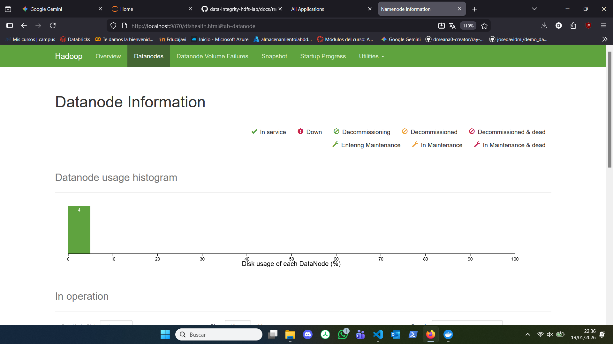
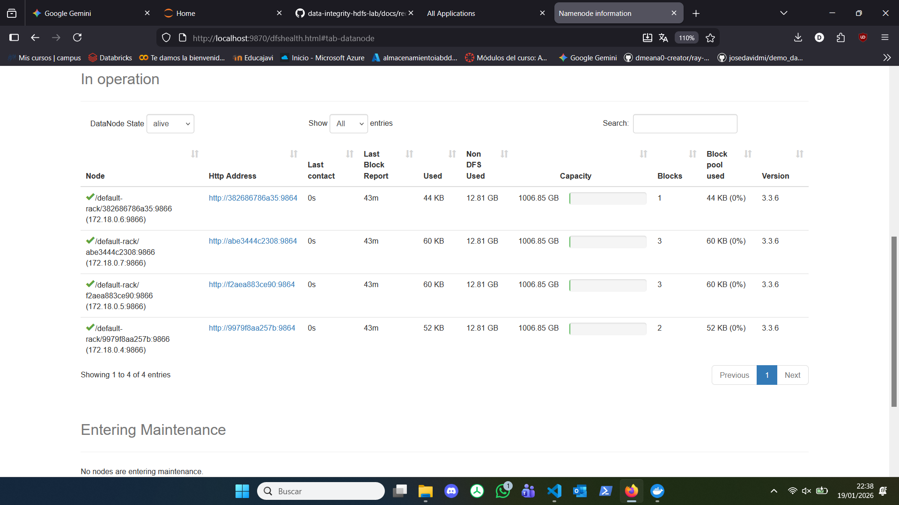

# Evidencias (plantilla)

Incluye aquí (capturas o logs) con fecha:

## 1) NameNode UI (9870)
- Captura con DataNodes vivos y capacidad

En esta captura podemos visualizar el número de datanodes que administra nuestro NameNode, en mi caso 4 datanodes.

A continuación se nos muestra los datanodes vivos y sus características en relación con su almacenamiento:

**Observación:** En la captura se confirma que los 4 nodos están en estado **"In Operation"** (vivos). También se observa la columna *Configured Capacity* (aprox. 1006 GB por nodo) y *DFS Used*, lo que valida la capacidad disponible del clúster para iniciar la ingesta.

## 2) Auditoría fsck
- Enlace/captura de salida (bloques/locations)
- Resumen (CORRUPT/MISSING/UNDER_REPLICATED)

## 3) Backup + validación
- Inventario origen vs destino
- Evidencias de consistencia (tamaños/rutas)

## 4) Incidente + recuperación
- Qué hiciste, cuándo y qué efecto tuvo
- Evidencia de detección y de recuperación

## 5) Métricas
- Capturas de docker stats durante replicación/copia
- Tabla de tiempos
